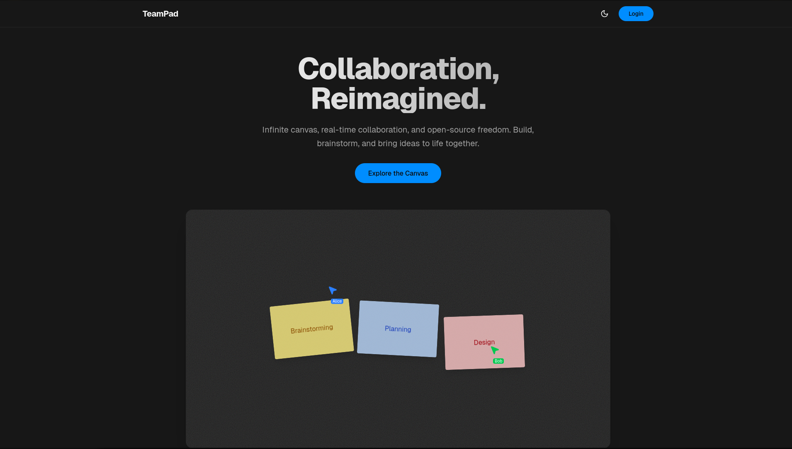
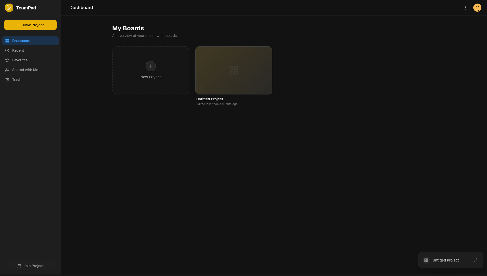
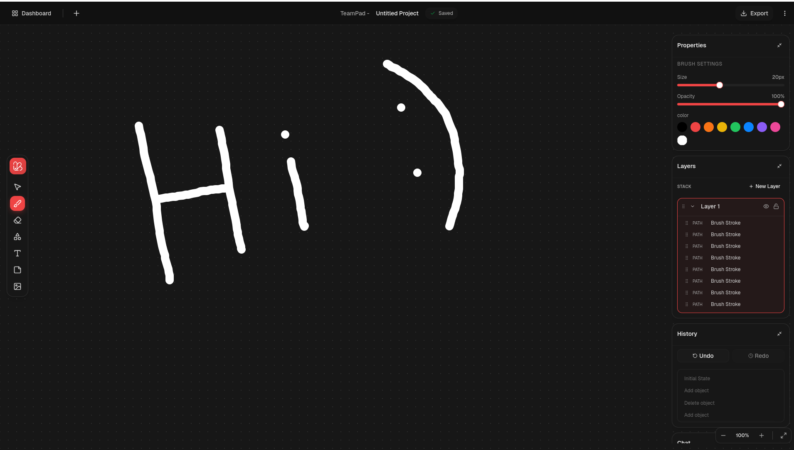
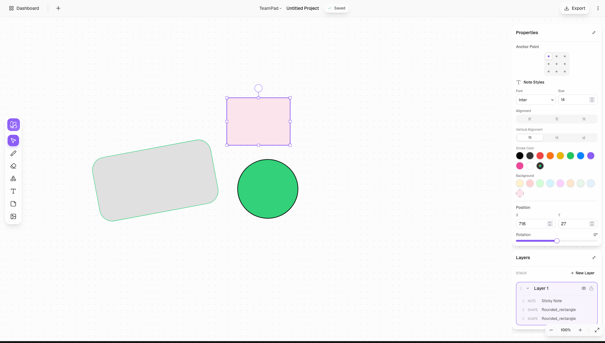
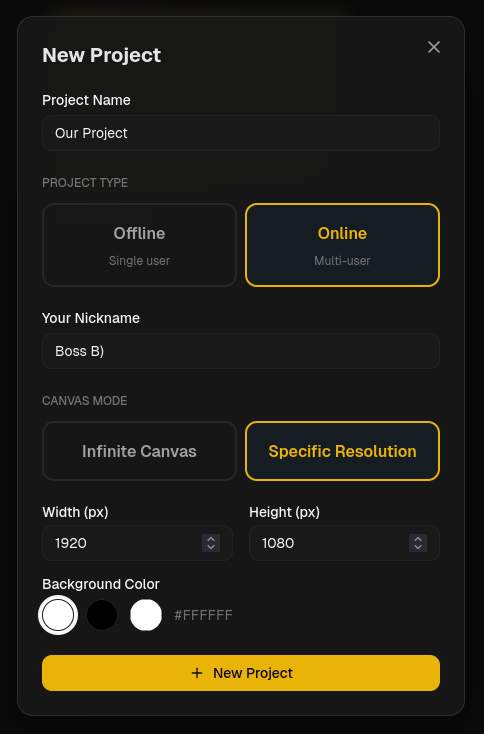
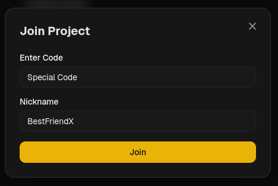
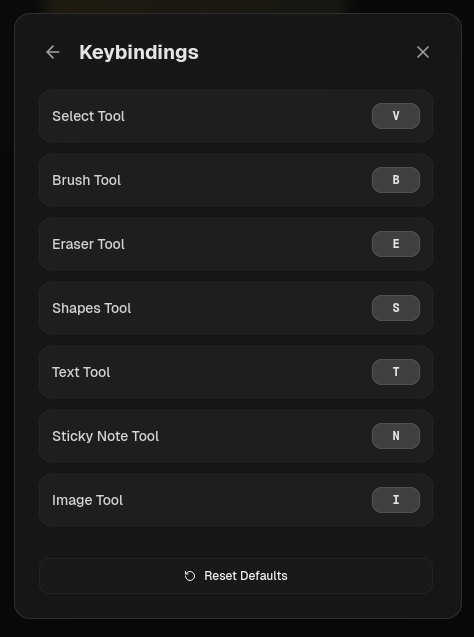
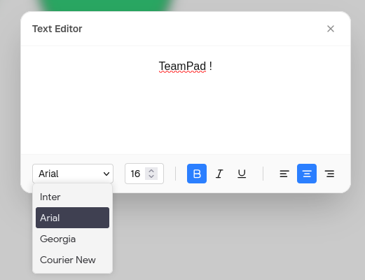
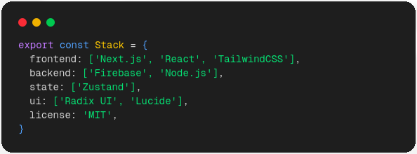
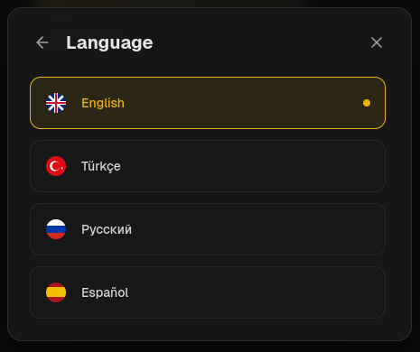

<div align="center">
  


# TeamPad

**A modern, real-time collaborative canvas editor built for teams**

[](https://www.typescriptlang.org/)
[](https://nextjs.org/)
[](https://reactjs.org/)
[](https://firebase.google.com/)
[](https://tailwindcss.com/)

[🚀 Live Demo](https://teampad.vercel.app) • [🐛 Report Bug](https://github.com/anlyetim/TeamPad/issues)

---

## ✨ Features

<table border="0">
  <tr>
    <td></td>
    <td></td>
  </tr>
  <tr>
    <td></td>
    <td></td>
  </tr>
</table>

TeamPad offers advanced drawing tools, seamless real-time synchronization, and comprehensive project management to accelerate your creative process. Shape your workspace with layer management, unlimited undo history, and customizable themes.

---

## 🎮 Usage

### **Unleash Your Imagination**


Create your project with a single click and start drawing immediately!

### **Better Together**


Combine your powers! Share your project code and create real-time wonders on the same canvas.

### **Master the Speed**


Use shortcuts to free your creativity. Every tool is at your fingertips, and every move is live!

### **Turn Ideas Into Words**


Add meaning to your designs and organize your notes elegantly with advanced text editing tools.

---

## 🏗️ Architecture

### **Tech Stack**


### **Core Concepts**
- **Tool Registry:** Isolated and centrally managed tool handlers.
- **Editor Runtime:** Single authoritative state manager for object operations and history.
- **Local-First Architecture:** Instant feedback with background server synchronization.

---

## 🌍 Language Support


---

## 🚀 Quick Start

### Prerequisites

- Node.js 18+ 
- npm, yarn, or pnpm

```bash
# Clone the repository
git clone [https://github.com/anlyetim/TeamPad.git](https://github.com/anlyetim/TeamPad.git)

# Install dependencies
npm install

# Run the development server
npm run dev

Open [http://localhost:3000](http://localhost:3000) in your browser.


```

### Installation

```bash
# Clone the repository
git clone https://github.com/anlyetim/TeamPad.git

# Navigate to the project directory
cd TeamPad

# Install dependencies
npm install
# or
yarn install
# or
pnpm install

# Set up environment variables
cp .env.example .env.local
# Edit .env.local with your Firebase configuration

# Run the development server
npm run dev
# or
yarn dev
# or
pnpm dev
```
---
### Firebase Setup

1. Create a Firebase project at [Firebase Console](https://console.firebase.google.com/)
2. Enable Firestore Database
3. Enable Anonymous Authentication
4. Copy your Firebase config to `.env.local`:

```env
NEXT_PUBLIC_FIREBASE_API_KEY=your_api_key
NEXT_PUBLIC_FIREBASE_AUTH_DOMAIN=your_auth_domain
NEXT_PUBLIC_FIREBASE_PROJECT_ID=your_project_id
NEXT_PUBLIC_FIREBASE_STORAGE_BUCKET=your_storage_bucket
NEXT_PUBLIC_FIREBASE_MESSAGING_SENDER_ID=your_messaging_sender_id
NEXT_PUBLIC_FIREBASE_APP_ID=your_app_id

```

**Made with ❤️ by [anlyetim](https://github.com/anlyetim)**

⭐ Star this repo if you find it helpful!
